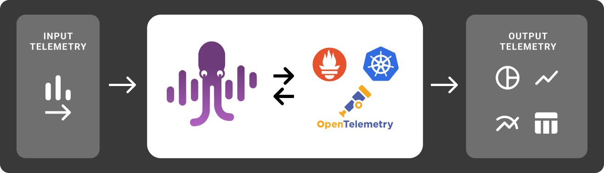

+++
title = 'Overview'
date = 2023-07-04T15:26:34-07:00
weight = 10
+++

MyDecisive.ai (MDAI) is an open-source self-service control plane for OpenTelemetry that makes it simple to oversee your observability telemetry and control costs efficiently. MDAI provides a self-monitoring container and a pipeline analysis tool for any supported infrastructure. Currently, MDAI is available for AWS.

MDAI is _not_:

- A proprietary observability platform
- A standalone monitoring platform
- A replacement for comprehensive monitoring solutions
- A managed service

MDAI works with OpenTelemetry and vendor platforms to control telemetry flow and reduce the costs associated with unneeded data.

MDAI is intended for devops engineers and leaders who want to take control of their telemetry and budgets. If you're searching for composable observability, less dependence on vendors, and more automated and intelligent solutions to visibility and analysis, MDAI is for you.
